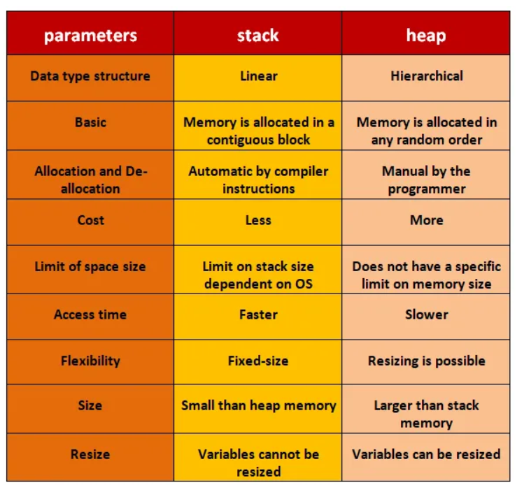

# Heap, Stack og Garbage Collector i C #

## Garbage Collector i C #

Garbage Collector (GC) er en viktig del av minnehåndteringen i C#. Den sørger for automatisk opprydding av objekter som ikke lenger er i bruk, slik at minnet kan frigjøres og brukes på nytt.

## Hva er Garbage Collector?

Garbage Collector er et system som automatisk finner og fjerner objekter i minnet som ikke lenger er tilgjengelige for programmet. Dette skjer uten at utvikleren trenger å skrive kode for å frigjøre minnet manuelt.

## Hvorfor har vi Garbage Collector?

I programmeringsspråk uten GC må utvikleren selv passe på å frigjøre minne, noe som kan føre til minnelekkasjer og feil. Med GC slipper man slike problemer, og det blir enklere å skrive stabile og sikre programmer.

## Fordeler med Garbage Collector

- Automatisk minnehåndtering
- Reduserer risiko for minnelekkasjer
- Forenkler utvikling og vedlikehold
- Øker sikkerheten i programmet

## Hvordan virker Garbage Collector på minne?

GC overvåker objektene som opprettes i heap-minnet. Når et objekt ikke lenger har noen referanser, blir det markert som "søppel". GC vil med jevne mellomrom kjøre en prosess som:

1. Marker objekter som fortsatt er i bruk
2. Identifiser objekter uten referanser
3. Frigjør minnet til de ubrukte objektene

GC i C# bruker generasjoner for å optimalisere ytelsen:

- **Generasjon 0:** Nye objekter
- **Generasjon 1:** Objekter som har overlevd én GC-runde
- **Generasjon 2:** Langlivede objekter

GC prioriterer å rydde opp i generasjon 0, siden det ofte er flest objekter her som raskt blir ubrukte.

---

Garbage Collector gjør minnehåndtering enklere og tryggere i C#, og er en viktig grunn til at språket er populært for moderne applikasjonsutvikling.

For å forstå hvor objekter blir laget med new nøkkelordet og hvordan dette skiller seg fra opprettelsen av statiske klasser i minne, er det viktig å forstå konseptene rundt heap, stack, og statisk lagringsområde (ofte kalt "static heap" i uformelle diskusjoner, men det er mer presist å referere til det som statisk lagringsområde eller statisk segment).

## Heap

 Heap er et område av minnet brukt for dynamisk minneallokering. Objekter som opprettes med `new` nøkkelordet i C# (og de fleste andre høy-nivå språk) blir allokert her.

 Når du oppretter et nytt objekt, reserveres minne på heapen for dette objektet. Referansen til objektet (som kan være en variabel i din kode) lagres typisk på stacken eller som en del av et annet objekt på heapen.

 Fordi minneallokering på heapen er dynamisk, må det frigjøres når det ikke lenger er i bruk for å unngå minnelekkasjer. I .NET frameworket håndteres dette automatisk av Garbage Collector (GC), som periodisk kjører for å finne og frigjøre minne som ikke lenger er tilgjengelig fra applikasjonen.

### C#-datatyper på Heap

Følgende datatyper og objekter havner vanligvis på heapen:

- **Klasser (`class`)**: Instanser opprettet med `new` lagres på heapen.
- **Records (`record`)**: Instanser av records lagres på heapen (records er referansetyper som klasser).
- **Array**: Alle arrays lagres på heapen, uansett elementtype.
- **Dynamisk allokerte objekter**: Alt som opprettes med `new`.

Eksempler:

```csharp
class Person { }
Person p = new Person(); // p refererer til et objekt på heapen

int[] tall = new int[10]; // Arrayen lagres på heapen

record Student(string Navn);
Student s = new Student("Ola"); // s refererer til et objekt på heapen
```

### C#-datatyper på Stack

Følgende datatyper havner vanligvis på stacken:

- **Primitive verdityper**: `int`, `double`, `bool`, `char` osv.
- **Structs (`struct`)**: Structs er verdityper og lagres på stacken når de er lokale variabler.
- **Enum**: Enums er verdityper og lagres på stacken.
- **Lokale variabler**: Verdityper som deklareres inne i metoder lagres på stacken.

Eksempler:

```csharp
int a = 5; // a lagres på stacken

struct Point { public int X, Y; }
Point p = new Point(); // p lagres på stacken

enum Farge { Rød, Grønn, Blå }
Farge f = Farge.Rød; // f lagres på stacken
```

> **Merk:** Hvis en struct eller verditype er et felt i en klasse, lagres selve verdien på heapen sammen med klassen, men hvis den er en lokal variabel, lagres den på stacken.

- **Hva det er:**

- **Bruk:**

- **Håndtering:**
 Minneallokering og deallokering på stacken er svært rask og skjer automatisk når funksjoner blir kalt og returnert.

### Sammenlikning



## Statisk Lagringsområde

- **Hva det er:**
 Dette er området i minnet hvor statiske medlemmer (variabler, metoder) av klasser blir lagret.

- **Bruk:**
 Når du deklarerer en klasse som static i C#, eller når du bruker statiske variabler eller metoder i dine klasser, blir disse medlemmene allokert i det statiske lagringsområdet. De er tilgjengelige gjennom hele applikasjonens levetid.

- **Håndtering:**
 Fordi statiske medlemmer ikke er knyttet til en spesiell instans av en klasse og er tilgjengelige gjennom hele applikasjonens levetid, blir de ikke samlet inn av GC på samme måte som dynamisk allokerte objekter på heapen.

## Sammenhengen Mellom dem og Garbage Collector (GC)

- **Heap:**
 Objekter allokert her må aktivt forvaltes av GC for å frigjøre minne som ikke lenger er i bruk.

- **Stack:**
 Minneallokering og -frigjøring her er automatisk og krever ikke inngripen av GC.

- **Statisk Lagringsområde:**
 Minne brukt her frigjøres ikke av GC, da det er tilgjengelig gjennom hele applikasjonens levetid.

I praksis betyr dette at dynamiske objekter (de som opprettes med `new`) lever på heapen og deres levetid håndteres av GC, mens statiske medlemmer og stack-tilordnede variabler håndteres automatisk av programmeringsspråkets runtime gjennom andre mekanismer. GC spiller en kritisk rolle i forvaltningen av heapen ved å sørge for at applikasjoner ikke bruker mer minne enn nødvendig og ved å bidra til å forebygge minnelekkasjer.

---
<div style="page-break-after: always;">

## Stack Overflow

En stack overflow oppstår når et program bruker mer stack-minne enn det som er tilgjengelig. Stacken har en begrenset størrelse, og hvis for mange funksjonskall eller lokale variabler legges på stacken uten at minnet frigjøres, vil programmet krasje med en "StackOverflowException".

### Vanlige årsaker til stack overflow

- **Uendelig eller for dyp rekursjon:** Hvis en funksjon kaller seg selv uten en korrekt basetilstand, vil det bygges opp stadig flere funksjonskall på stacken.
- **Store lokale variabler:** Hvis du oppretter store datastrukturer som arrays eller objekter som lokale variabler, kan stacken fylles opp raskt.

### Eksempel på stack overflow i C #

```csharp
void Rekursjon()
{
 Rekursjon(); // Uendelig rekursjon gir stack overflow
}
```

### Hvordan unngå stack overflow?

- Sørg for at rekursive funksjoner alltid har en basetilstand som avslutter rekursjonen.
- Unngå å bruke store datastrukturer som lokale variabler – bruk heapen (f.eks. med `new`) hvis du trenger mye minne.
- Vær oppmerksom på hvor dypt funksjonskallene dine kan gå.
