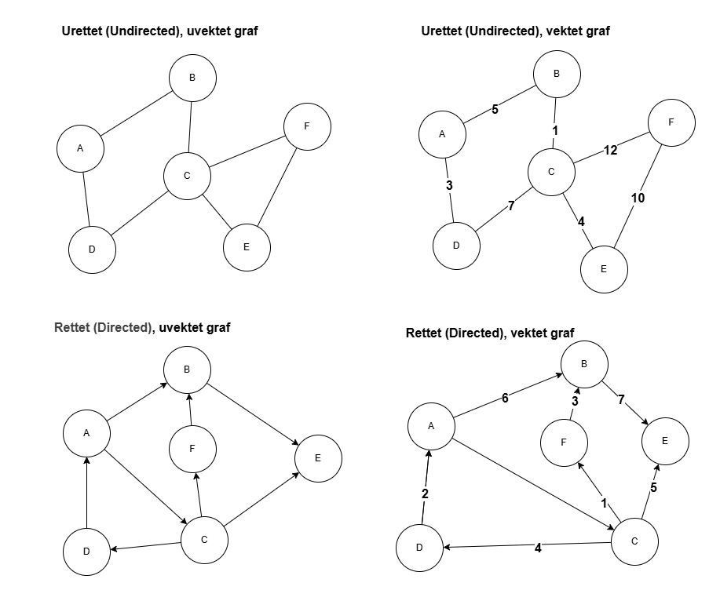

# Introduksjon til Grafer

## Viktige begreper

| Begrep   | Forklaring |
|----------|------------|
| Node (Vertex) | Et punkt i grafen som representerer et objekt/enhet |
| Kant (Edge) | En forbindelse mellom to noder |
| Rettet kant (Directed edge) | Kant med retning, f.eks. A → B |
| Urettet kant (Undirected edge) | Kant uten retning, f.eks. A ↔ B |
| Vekt (Weight) | Et tall som representerer kostnad, avstand eller tid på en kant |
| Adjacency List | Representasjon av grafen med lister av naboer for hver node |
| Adjacency Matrix | Representasjon av grafen som en matrise med 0/1 eller vekter |
| BFS (Breadth-First Search) | Traverseringsalgoritme som utforsker grafen nivå for nivå |
| DFS (Depth-First Search) | Traverseringsalgoritme som utforsker grafen dypt før tilbakegang |
| MST (Minimum Spanning Tree) | Et delsett av kantene som forbinder alle noder med minimal total vekt |

## Hva er en graf?

En **graf** er en datastruktur som består av **noder (vertices)** og **kanter (edges)** som forbinder nodene.

Grafer brukes til å representere forbindelser mellom elementer. Eksempler:

- Veinettverk (byer som noder, veier som kanter)
- Sosiale nettverk (brukere som noder, vennskap som kanter)
- Datakommunikasjon (datamaskiner som noder, nettverkskabler som kanter)

## Typer grafer

1. **Urettet graf**: Kantene har ingen retning.
2. **Rettet graf (digraf)**: Kantene har retning fra én node til en annen.
3. **Vektet graf**: Kantene har en kostnad eller vekt (for eksempel avstand, tid eller kapasitet).

### Eksempler

| Graf | Type | Egenskaper | Eksempel på bruk |
|------|------|------------|------------------|
| Øverst venstre | **Urettet, uvektet graf** | - Kanter uten retning   - Ingen vekter på kantene | Vennskap i et sosialt nettverk (hvis A er venn med B, så er B venn med A) |
| Øverst høyre | **Urettet, vektet graf** | - Kanter uten retning   - Vekter representerer kostnad/avstand/tid | Veinettverk mellom byer med avstand som vekt |
| Nederst venstre | **Rettet, uvektet graf** | - Kanter har retning (piler)   - Ingen vekter på kantene | Følgerelasjoner på Twitter (A følger B, B følger ikke nødvendigvis A) |
| Nederst høyre | **Rettet, vektet graf** | - Kanter har retning   - Vekter representerer kostnad/avstand/tid | Leveringsruter med retning og ulike kostnader, flybilletter med ulik pris hver vei |

## Forklaring av graf-typer
- **Rettet (Directed)**: Kanter har en retning, representert med piler.
- **Urettet (Undirected)**: Kanter uten retning, representerer gjensidige forbindelser.
- **Vektet (Weighted)**: Kantene har en kostnad, avstand eller tid.
- **Uvektet (Unweighted)**: Alle kanter antas å ha lik kostnad.

Disse grafene viser forskjellige kombinasjoner av egenskaper og brukes i ulike kontekster som nettverk, logistikk, sosiale medier og rutefinning.

## Representasjon av grafer

- **Adjacency List**: For hver node lagres en liste over noder den har kanter til.
- **Adjacency Matrix**: En matrise hvor rad og kolonne representerer noder, og cellene inneholder 0/1 eller vekter.

## Algoritmer for grafer

- **DFS (Depth-First Search)**: Utforsker så langt som mulig langs hver gren.
- **BFS (Breadth-First Search)**: Utforsker nivå for nivå.
- **Dijkstra**: Finner korteste vei i en vektet graf med positive vekter.
- **Bellman-Ford**: Korteste vei, støtter negative vekter.
- **A***: Heuristisk søk for korteste vei.
- **Prim/Kruskal**: Lager minimum spenn-tre (MST) fra en graf.
- **Topologisk sortering**: Sorterer noder i rettede asykliske grafer (DAG).

## Bruksområder

- Ruteplanlegging (Google Maps, GPS)
- Nettverksanalyse (Facebook, LinkedIn)
- Anbefalingssystemer (Netflix, Amazon)
- Flytsystemer (maks flyt/min kostnad)

