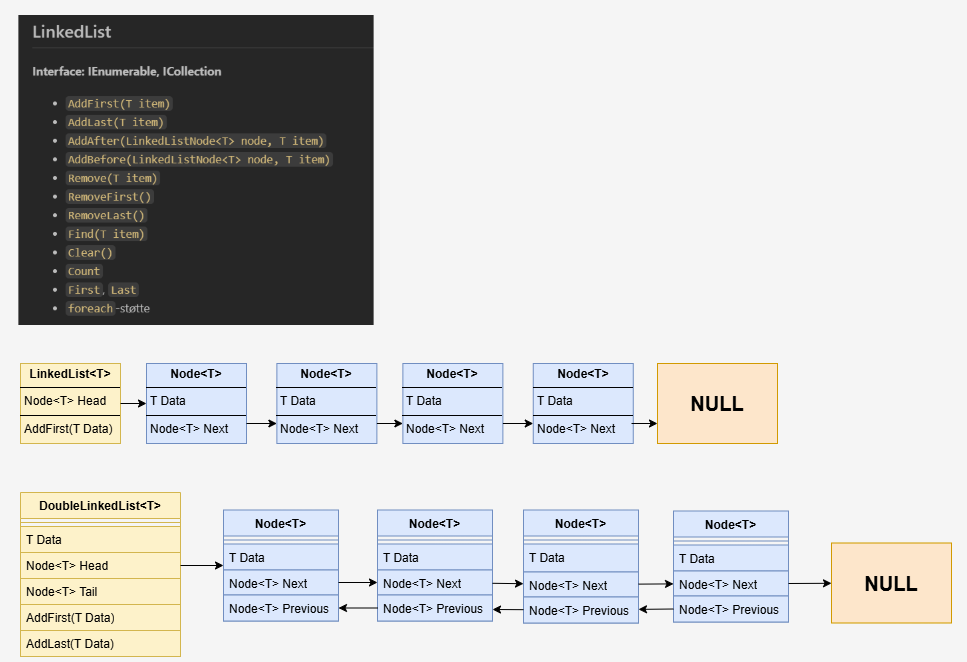

# Linked List og Dobbel Linked List

En **linked list (lenket liste)** er en lineær datastruktur der elementene (noder) er lenket sammen med pekere. 
I motsetning til arrays er ikke elementene lagret i sammenhengende minne, men bundet sammen via referanser.

## Viktige begreper
- **Node:** En node inneholder data og en peker (Next) til neste node.
- **Head:** Første node i listen.
- **Tail:** Siste node i listen (brukes i dobbel lenket liste).
- **Next:** Peker til neste node.
- **Previous:** Peker til forrige node (kun i dobbel lenket liste).

<div style="page-break-after:always;"></div>

## Eksempler

Hver node peker kun til neste node.



Fordeler:
- Dynamisk størrelse
- Effektiv innsetting/sletting i midten når man har peker til riktig node

Ulemper:
- Må traversere fra start for å finne et element eller forrige node

<div style="page-break-after:always;"></div>

### C# eksempel
```csharp
class Node<T>
{
    public T Data;
    public Node<T> Next;
    public Node(T data) { Data = data; Next = null; }
}

class LinkedList<T>
{
    public Node<T> Head;
    public void AddFirst(T data)
    {
        var newNode = new Node<T>(data);
        newNode.Next = Head;
        Head = newNode;
    }
}
```

## Dobbel lenket liste (Doubly Linked List)
Hver node peker både til neste **og** forrige node.

Fordeler:
- Kan traversere i begge retninger
- Enklere sletting og innsetting midt i listen, fordi man har pekere til både forrige og neste node

Ulemper:
- Krever mer minne (ekstra peker per node)

<div style="page-break-after:always;"></div>

### C# eksempel
```csharp
class DoubleNode<T>
{
    public T Data;
    public DoubleNode<T> Next;
    public DoubleNode<T> Prev;
    public DoubleNode(T data) { Data = data; Next = null; Prev = null; }
}

class DoubleLinkedList<T>
{
    public DoubleNode<T> Head;
    public DoubleNode<T> Tail;
    public void AddFirst(T data)
    {
        var newNode = new DoubleNode<T>(data);
        if (Head == null)
        {
            Head = Tail = newNode;
        }
        else
        {
            newNode.Next = Head;
            Head.Prev = newNode;
            Head = newNode;
        }
    }
}
```

## Oppsummering
- **Enkelt lenket liste:** Pekere kun én vei.
- **Dobbel lenket liste:** Pekere begge veier.
- Begge har lineær søketid, men dobbel gir enklere innsetting/sletting.

