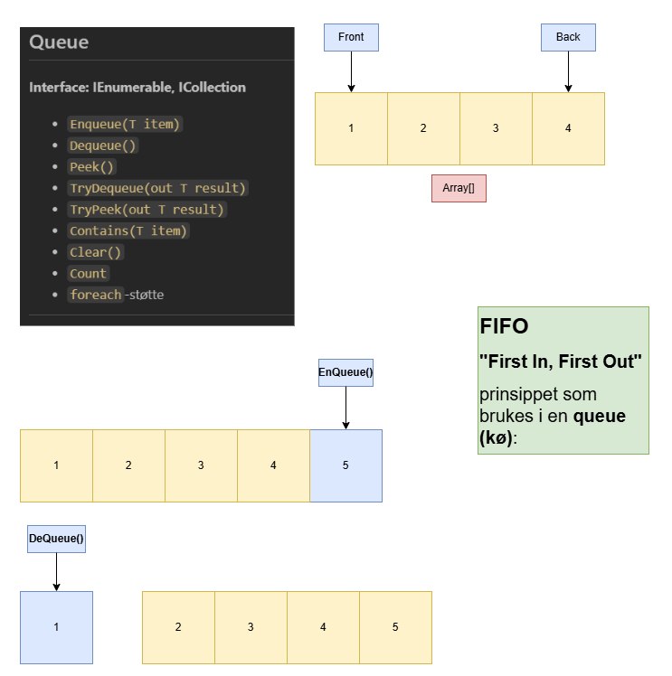

# Queue og FIFO-prinsippet

En **queue (kø)** er en datastruktur som følger **FIFO**-prinsippet:  
**First In, First Out** – det første elementet som legges inn er det første som tas ut.

## Viktige operasjoner
- **Enqueue(T item)**: Legger et element bakerst i køen.
- **Dequeue()**: Fjerner og returnerer elementet foran i køen.
- **Peek()**: Returnerer elementet foran uten å fjerne det.
- **Count**: Antall elementer i køen.

<div style="page-break-after:always;"></div>

## FIFO-prinsippet forklart
Tenk på en kø i butikken:
1. Den som stiller seg først i køen blir betjent først.
2. Nye personer stiller seg bakerst i køen.

### Eksempel

Starttilstand (Front peker på 1, Back peker på 4):



Elementet **1** ble fjernet først, fordi det var først lagt inn (FIFO).

<div style="page-break-after:always;"></div>

## C# eksempel med Queue<T>

```csharp
using System;
using System.Collections.Generic;

class Program
{
    static void Main()
    {
        Queue<int> queue = new Queue<int>();
        
        queue.Enqueue(1);
        queue.Enqueue(2);
        queue.Enqueue(3);
        queue.Enqueue(4);

        Console.WriteLine(queue.Peek()); // 1
        queue.Enqueue(5);

        Console.WriteLine(queue.Dequeue()); // 1
        Console.WriteLine(queue.Dequeue()); // 2

        foreach (var item in queue)
        {
            Console.WriteLine(item); // 3, 4, 5
        }
    }
}
```

## Oppsummering
- **FIFO**: Først inn, først ut.
- Brukes i situasjoner som meldingskøer, printerkøer, oppgaveplanlegging.
- Operasjoner skjer i begge ender: innsetting bak, fjerning foran.

