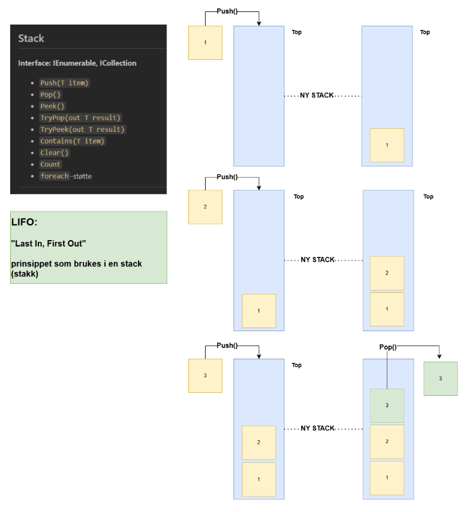

# Stack og LIFO-prinsippet

En **stack (stakk)** er en datastruktur som følger **LIFO**-prinsippet:  
**Last In, First Out** – det siste elementet som legges inn er det første som tas ut.

## Viktige operasjoner
- **Push(T item)**: Legger et element på toppen av stacken.
- **Pop()**: Fjerner og returnerer elementet på toppen.
- **Peek()**: Returnerer elementet på toppen uten å fjerne det.
- **Count**: Antall elementer i stacken.

<div style="page-break-after:always;"></div>>

## LIFO-prinsippet forklart
Tenk på en stabel tallerkener:
1. Den siste tallerkenen du legger på toppen er den første du tar av.

### ASCII-eksempel

Starttilstand (Top peker på toppen):



Elementet **3** ble fjernet først, fordi det var sist lagt inn (LIFO).

<div style="page-break-after:always;"></div>

## C# eksempel med Stack<T>

```csharp
using System;
using System.Collections.Generic;

class Program
{
    static void Main()
    {
        Stack<int> stack = new Stack<int>();
        
        stack.Push(1);
        stack.Push(2);
        stack.Push(3);

        Console.WriteLine(stack.Peek()); // 3
        Console.WriteLine(stack.Pop());  // 3
        Console.WriteLine(stack.Pop());  // 2

        foreach (var item in stack)
        {
            Console.WriteLine(item); // 1
        }
    }
}
```

## Oppsummering
- **LIFO**: Sist inn, først ut.
- Brukes i situasjoner som tilbakeknapp i nettleser, kallstakk i programmer.
- Operasjoner skjer på samme ende: toppen.

