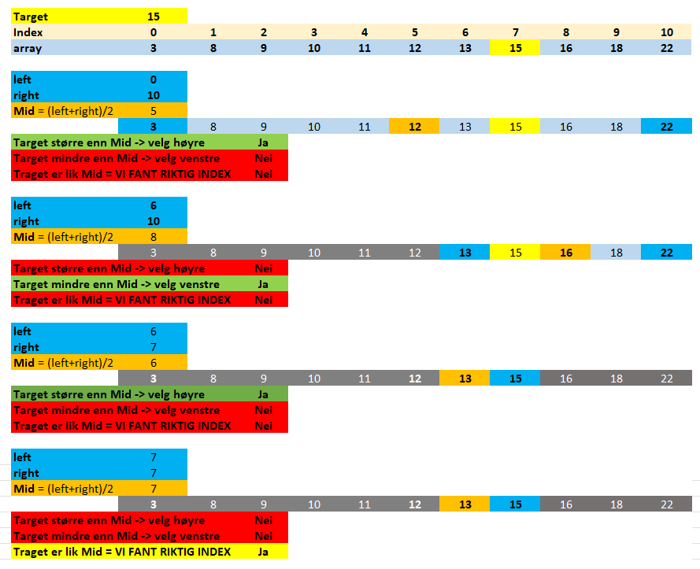

# Dokumentasjon: Binærsøk

## Hva er binærsøk?

Binærsøk er en effektiv algoritme for å finne et element i en **sortert** samling.
Prinsippet er å gjentatte ganger dele søkeområdet i to:

1. Sjekk midterste element.
2. Hvis målet er mindre enn midterste verdi, søk i venstre halvdel.
3. Hvis målet er større, søk i høyre halvdel.
4. Gjenta til elementet er funnet eller søkeområdet er tomt.

Tidskompleksitet: **O(log n)** i gjennomsnitt og i verste fall (for sorterte data).

---

## Hvorfor brukes binærsøk?

- Mye **raskere enn lineært søk** i store datasett.
- Krever **sortert data**, men da gir det logaritmisk søketid.
- Brukes i søkemotorer, databaser, og mange bibliotekfunksjoner (som `Array.BinarySearch` i C#).

---

## Når kan binærsøk brukes?

- Når dataene **allerede er sortert**, eller du kan holde dem sortert.
- Når du har **tilgang via indeks eller struktur som gir rask "midt"-tilgang**.
- Når datasettet er **statisk eller endres sjelden** (innsetting i sortert liste er dyrere).

---

## 3 måter å lagre dataene for søk

Det finnes flere måter å strukturere data slik at binærsøk kan brukes effektivt.

### 1) Sortert array eller liste

- **Beskrivelse:** Verdiene lagres sortert i et array eller liste.
- **Fordeler:**
  - Rask tilgang via indeks (O(1)).
  - Enkel implementasjon av binærsøk.
- **Ulemper:**
  - Dyre innsettinger/slettinger (må flytte elementer).
- **Egner seg for:**
  - Statisk datasett, eller få endringer.

### 2) Binært søketre (BST)

- **Beskrivelse:** Hierarkisk struktur der venstre < node < høyre.
- **Fordeler:**
  - Enkel innsetting/sletting uten å flytte elementer.
  - Søketid O(log n) hvis balansert.
- **Ulemper:**
  - Kan bli ubalansert (da O(n) i verste fall), krever evt. balansering.
- **Egner seg for:**
  - Dynamiske datasett med mange innsettinger/slettinger.

### 3) Array som representerer et tre (heap-stil)

- **Beskrivelse:** Bruk en array der:
  - Rot på indeks 1.
  - Venstre barn = 2*i, høyre barn = 2*i + 1.
- **Fordeler:**
  - Effektivt for komplette trær (f.eks. heap).
  - Ingen pekere, kun aritmetikk på indekser.
- **Ulemper:**
  - Ikke effektiv for glisne trær (mange null-plasser).
- **Egner seg for:**
  - Heaps, prioritetskøer, eller når treet er tett/komplett.

---

## Oppsummeringstabell

| Struktur                 | Søketid (gj.snitt) | Innsetting | Kommentar |
|--------------------------|-------------------|------------|-----------|
| Sortert array/liste      | O(log n)          | O(n)       | Raskt søk, dyr innsetting |
| Binært søketre (balansert)| O(log n)         | O(log n)   | God for dynamiske datasett |
| Array som tre (heap)     | O(log n)          | O(log n)   | Brukes mest i heaps/prioritetskøer |

## Example

