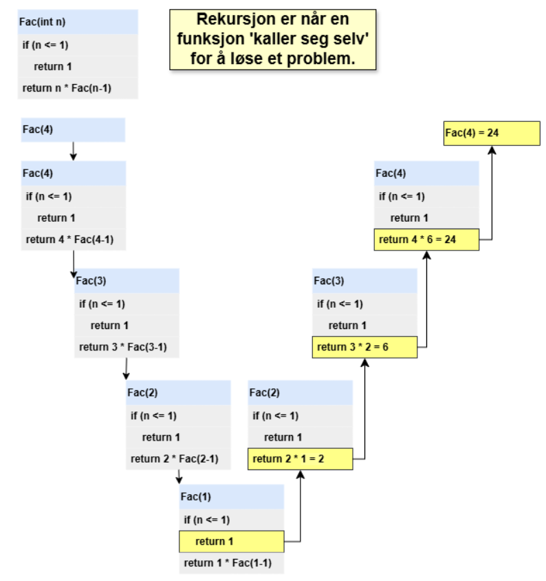

# Grunnleggende innføring i rekursjon

## Hva er rekursjon?

Rekursjon er når en funksjon **kaller seg selv** for å løse et problem.
I stedet for å bruke løkker (f.eks. `for` eller `while`), kan vi bruke rekursjon til å løse problemer ved å dele dem opp i **mindre delproblemer**.

En rekursiv funksjon består alltid av to viktige deler:

1. **Basis-tilfelle (stoppbetingelse)** – forteller når funksjonen skal stoppe.
2. **Rekursivt kall** – der funksjonen kaller seg selv med et enklere problem.

---

## Eksempel 1: Fakultet

Fakultet (n!) er et klassisk eksempel på rekursjon.

Matematisk definisjon:

- 0! = 1  
- n! = n × (n-1)!

### C# kode

```csharp
using System;

class Program
{
    static int Fak(int n)
    {
        if (n == 0) // Basis-tilfelle
            return 1;
        else
            return n * Fak(n - 1); // Rekursivt kall
    }

    static void Main()
    {
        Console.WriteLine(Fak(5)); // 5! = 120
    }
}
```
<div style="page-break-after:always;"></div>

### **Stack-representasjon**




---
<div style="page-break-after:always;"></div>

## Stack og Heap i rekursjon

- **Stack**: Alle funksjonskall legges her. Variabler som er lokale til funksjonen lagres i stacken.  
  Hvis rekursjonen blir for dyp, får vi en **StackOverflowException** i C#.

- **Heap**: Brukes til objekter (f.eks. lister, arrays, klasser). Rekursjon i seg selv bruker ikke heapen direkte, men kan gjøre det hvis vi oppretter objekter i hvert kall.

---

## Fordeler og ulemper med rekursjon

### Fordeler

- Enkel og elegant kode (ofte kortere enn løkker).
- Godt egnet for problemer som naturlig er rekursive (trestrukturer, grafer, del-og-hersk algoritmer).  
- Kan være lettere å lese og forstå logisk.

### Ulemper

- Bruker mer minne (stacken fylles opp med kall).
- Kan være tregere enn løkker pga. overhead fra funksjonskall.
- Risiko for **StackOverflowException** hvis stoppbetingelsen ikke er korrekt eller hvis problemet er for stort.

---

## Når brukes rekursjon?

- Når problemet kan deles opp i mindre, lignende delproblemer (f.eks. sortering, søk, grafer, tretraversering).  
- Når en iterativ løsning blir komplisert, men en rekursiv løsning blir naturlig.  
- Eksempler:  
  - **Binærsøk**
  - **QuickSort**
  - **Tre- og graftraversering (DFS, BFS med rekursjon)**

---

## Oppsummering

- Rekursjon = funksjon kaller seg selv.
- Viktig med **basis-tilfelle** for å unngå uendelig kall.  
- Stacken spiller en sentral rolle i hvordan kallene håndteres.  
- Bruk rekursjon når det gir klarhet, men vær bevisst på ressursbruk.
