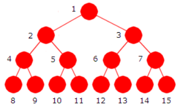

# Trær i algoritmer og datastrukturer (C#-fokus)

## Hva er et tre?

Et (rettet) **tre** er en hierarkisk struktur av **noder** og **kanter** med følgende begreper:

- **Rot**: øverste node.
- **Forelder/barn**: relasjon mellom tilstøtende nivåer.
- **Blad**: node uten barn.
- **Høyde (h)**: lengden på lengste sti fra rot til blad.
- **Grad (branching factor)**: maks antall barn per node (ofte 2 i binære trær).
- **Balanse**: hvor dyp/skjev strukturen er. De fleste operasjoner har kost `O(h)`; derfor er det ønskelig at `h = O(log n)` for store datasett.

**Typiske operasjoner**: søk, innsetting, sletting, traversering (gå gjennom noder), og aggregering (sum/min/max på intervaller).

---

## Traversering

**Depth-First Search (DFS)**

- **Preorder**: Node → Venstre → Høyre  
- **Inorder** (BST): Venstre → Node → Høyre (gir sortert rekkefølge i BST)  
- **Postorder**: Venstre → Høyre → Node

**Breadth-First Search (BFS)**

- **Level-order**: nivå for nivå (bruk kø).

<div style="page-break-after:always;"></div>

**C#-eksempler**

```csharp
public static IEnumerable<T> InOrder<T>(Node<T>? node)
{
    if (node is null) yield break;
    foreach (var v in InOrder(node.Left)) yield return v;
    yield return node.Value;
    foreach (var v in InOrder(node.Right)) yield return v;
}

public static IEnumerable<T> LevelOrder<T>(Node<T>? root)
{
    if (root is null) yield break;
    var q = new Queue<Node<T>>();
    q.Enqueue(root);
    while (q.Count > 0)
    {
        var n = q.Dequeue();
        yield return n.Value;
        if (n.Left != null) q.Enqueue(n.Left);
        if (n.Right != null) q.Enqueue(n.Right);
    }
}
```

---

## Vanlige tretyper (med bruksområder)

### 1) Binært tre

Hver node har inntil to barn (venstre/høyre). Brukes ofte som grunnstruktur for mer spesialiserte trær.



### 2) Binært søketre (BST)

Invariante: alle verdier i venstre undertre `<` nodeverdien, alle i høyre `>` nodeverdien (eller en definert duplikatpolicy). Gir søk/innsett/slett i gjennomsnitt `O(log n)`, men kan bli `O(n)` i verstefall hvis treet blir skjevt.

<div style="page-break-after:always;"></div>

### 3) Selvbalanserende BST

Holder høyden omtrent logaritmisk automatisk.

- **AVL-tre** – svært god søkeytelse; strenger balanse.
- **Rød–svart-tre** – mer “slapp” balanse; ofte brukt i standardbibliotek fordi oppdateringer er effektive.
- **Treap/Splay** – randomisert/selvjusterende varianter (mer spesialiserte bruksområder).

### 4) Heap (prioritetskø)

Et komplett binært tre som tilfredsstiller heap-ordning (min- eller maks-heap). Effektivt for å få ut høyest/lavest prioritet (f.eks. Dijkstra, A*, schedulere).

### 5) Trie (prefikstre)

Trestruktur over tegn hvor stier representerer prefikser. Meget nyttig til `StartsWith`, auto-komplettering, stavekontroll, ordlister.

### 6) B-trær / B+-trær

Disk-/cache-vennlige multi-veis trær. Standard i databaser/filsystemer for indekser og range-spørringer.

### 7) Segmenttre & Fenwick-tre (BIT)

Effektive range-aggregater (sum/min/max) og oppdateringer i `O(log n)` for strømmer av data (f.eks. tidsserier, rangeringstabeller).

### 8) N-ære trær (generelle trær)

Hver node kan ha vilkårlig antall barn; brukes i filsystemer, DOM, AST i kompilatorer.

---
<div style="page-break-after:always;"></div>

## Representasjon av trær i kode

### A) Node-baserte (pekerstrukturer)

**Binært tre**

```csharp
public class Node<T>
{
    public T Value;
    public Node<T>? Left;
    public Node<T>? Right;
    public Node(T value) => Value = value;
}
```

**Generelt (N-ært) tre**

```csharp
public class TreeNode<T>
{
    public T Value;
    public List<TreeNode<T>> Children = new();
    public TreeNode(T value) => Value = value;
}
```

**Med forelderpeker (opp/ned)**

```csharp
public class Node<T>
{
    public T Value;
    public Node<T>? Parent;
    public List<Node<T>> Children = new();
    public Node(T value) => Value = value;
}
```

Fordel å kunne navigere oppover; husk å vedlikeholde `Parent` ved endringer.
<div style="page-break-after:always;"></div>

### B) Array-basert (implicit binært tre/heap)

For et komplett binært tre (særlig heap): rot på indeks `0`, venstre barn `2*i+1`, høyre barn `2*i+2`.

```csharp
int[] heap = new int[capacity];
// Heap-operasjoner: sift-up / sift-down for å opprettholde heap-ordning.
```

### C) Adjacency-lister (grafrepresentasjon)

Praktisk når treet inngår i grafflyt:

```csharp
var tree = new Dictionary<int, List<int>>();
tree[1] = new() { 2, 3 };
tree[2] = new() { 4, 5 };
tree[3] = new();
```

### D) Left-Child/Right-Sibling (LC-RS) for N-ære trær

Representerer vilkårlig tre med to pekere per node (første barn + neste søsken):

```csharp
public class LCNode<T>
{
    public T Value;
    public LCNode<T>? FirstChild;
    public LCNode<T>? NextSibling;
}
```

### E) Relasjonsdatabase (ParentId-tabell)

Vanlig i SQL og lagring:

```
Id | ParentId | Value
1  | NULL     | Root
2  | 1        | A
3  | 1        | B
4  | 2        | C
```

Traverseres med rekursive spørringer / CTEs.

---
<div style="page-break-after:always;"></div>

## Mini-implementasjoner 

**BST (innsett/søk/slett + inorder)**

```csharp
public class Node<T>
{
    public T Value;
    public Node<T>? Left;
    public Node<T>? Right;
    public Node(T value) => Value = value;
}

public class BinarySearchTree<T>
{
    private Node<T>? _root;
    private readonly IComparer<T> _cmp;
    public BinarySearchTree(IComparer<T>? comparer = null)
        => _cmp = comparer ?? Comparer<T>.Default;

    public bool Contains(T value) => Find(_root, value) is not null;
    private Node<T>? Find(Node<T>? node, T value)
    {
        while (node != null)
        {
            int c = _cmp.Compare(value, node.Value);
            if (c == 0) return node;
            node = c < 0 ? node.Left : node.Right;
        }
        return null;
    }

    public void Insert(T value) => _root = InsertRec(_root, value);
    private Node<T> InsertRec(Node<T>? node, T value)
    {
        if (node is null) return new Node<T>(value);
        int c = _cmp.Compare(value, node.Value);
        if (c < 0) node.Left = InsertRec(node.Left, value);
        else if (c > 0) node.Right = InsertRec(node.Right, value);
        else node.Right = InsertRec(node.Right, value); // duplikatpolicy
        return node;
    }

    public bool Remove(T value)
    {
        bool removed;
        (_root, removed) = RemoveRec(_root, value);
        return removed;
    }
    private (Node<T>? node, bool removed) RemoveRec(Node<T>? node, T value)
    {
        if (node is null) return (null, false);
        int c = _cmp.Compare(value, node.Value);
        if (c < 0) { (node.Left, var r) = RemoveRec(node.Left, value); return (node, r); }
        if (c > 0) { (node.Right, var r) = RemoveRec(node.Right, value); return (node, r); }

        if (node.Left is null) return (node.Right, true);
        if (node.Right is null) return (node.Left, true);

        var (min, newRight) = PopMin(node.Right!); // inorder-etterfølger
        min.Left = node.Left;
        min.Right = newRight;
        return (min, true);
    }
    private (Node<T> min, Node<T>? newRoot) PopMin(Node<T> node)
    {
        if (node.Left is null) return (node, node.Right);
        var parent = node;
        var cur = node.Left;
        while (cur!.Left != null) { parent = cur; cur = cur.Left; }
        parent.Left = cur.Right;
        cur.Right = node;
        return (cur, node);
    }

    public IEnumerable<T> InOrder()
    {
        var stack = new Stack<Node<T>>();
        var cur = _root;
        while (cur != null || stack.Count > 0)
        {
            while (cur != null) { stack.Push(cur); cur = cur.Left; }
            cur = stack.Pop();
            yield return cur.Value;
            cur = cur.Right;
        }
    }
}
```

---
<div style="page-break-after:always;"></div>

## C#/.NET-biblioteker som dekker temaet
>
> .NET har ikke en generell `Tree<T>` i standardbiblioteket, men flere **sorterte** og/eller **tre-baserte** samlinger finnes:

- **`SortedSet<T>`** – holder elementer sortert med valgt `IComparer<T>`. Duplikater ikke tillatt. Bruk når du trenger sortert, unik mengde med `O(log n)`-operasjoner. citeturn0search0turn0search4
- **`SortedDictionary<TKey,TValue>`** – sortert på *key*, effektiv `O(log n)` innsetting/sletting for usorterte data. Egner seg når du trenger map/dictionary *og* sortert nøkkelrekkefølge. citeturn0search1turn0search5
- **`PriorityQueue<TElement,TPriority>`** – innebygd prioritetskø (min-heap) hvor elementet med **lavest** prioritet dequeues først. Flott for Dijkstra/A*. citeturn0search2turn0search6
- **Immutable-kolleksjoner** (`System.Collections.Immutable` – via NuGet):  
  **`ImmutableSortedSet<T>`** og **`ImmutableSortedDictionary<TKey,TValue>`** gir tråd-sikker, vedvarende (persistent) datastruktur med sortert iterasjon. Bra for funksjonell stil, snapshotting, og deling mellom tråder. citeturn0search3turn0search7turn0search11

**Eksempler**

```csharp
// SortedSet<T> med egendefinert comparer
var set = new SortedSet<string>(StringComparer.OrdinalIgnoreCase)
{ "Banana", "apple", "Cherry" }; // itererer: apple, Banana, Cherry

// SortedDictionary<TKey,TValue> for range-aktige operasjoner via Keys
var sd = new SortedDictionary<int, string>();
sd[10] = "ti"; sd[3] = "tre"; sd[7] = "sju"; // itererer i nøkkel-rekkefølge

// PriorityQueue<TElement,TPriority> (min-heap på TPriority)
var pq = new PriorityQueue<string, int>();
pq.Enqueue("oppgaveA", 3);
pq.Enqueue("oppgaveB", 1);
pq.Enqueue("oppgaveC", 2);
pq.TryDequeue(out var elem, out var prio); // elem="oppgaveB", prio=1
```

> For graforienterte oppgaver (spenntrær, topologi, osv.) kan du bruke generiske grafbibliotek sammen med trelogikk, men for klassiske tre-samlinger er typene ovenfor mest relevante i .NETs økosystem.

---

## Når velger du hva?

- **Sortert orden + medlemskap** → `SortedSet<T>`  
- **Sortert orden + key→value** → `SortedDictionary<TKey,TValue>`  
- **Alltid hente “neste viktigste”** → `PriorityQueue<TElement,TPriority>`  
- **Uforanderlighet / deling mellom tråder** → `ImmutableSortedSet/Dictionary`  
- **Prefikssøk/autocomplete** → Trie (egen implementasjon)  
- **Intervaller/aggregater** → Segmenttre/Fenwick  
- **Disk/DB** → B/B+-trær (vanligvis via database/index, ikke egen implementasjon)

---

## Vanlige fallgruver og tips

- **Duplikatpolicy i BST**: tillatt/avvis/antall–felt; vær konsekvent.
- **Sørg for sammenligner (`IComparer<T>`)** som matcher domenet (f.eks. kultur-agnostisk strengesammenlikning).
- **Traversering med iterators (`yield`)** er minneeffektivt.
- **Iterativ vs rekursiv**: iterative metoder unngår kallestakk-overløp for skjeve trær.
- **Test sletting i BST** grundig (0/1/2 barn-tilfellene).
- **Bruk bibliotekstyper i produksjon** når mulig – få gratis balansering, ytelse og hjørnetestdekning.

---

## Videre lesing (offisielle kilder)

- Microsoft Docs – `SortedSet<T>` og konstruktører. citeturn0search0turn0search4  
- Microsoft Docs – `SortedDictionary<TKey,TValue>` og kompleksitetsnotater. citeturn0search1  
- Microsoft Docs – `PriorityQueue<TElement,TPriority>`. citeturn0search2  
- Microsoft Docs/NuGet – `System.Collections.Immutable` (`ImmutableSortedSet`, osv.). citeturn0search3turn0search7turn0search11

---

*Skreddersy gjerne denne filen til undervisning ved å legge til øvingsoppgaver (implementer en enkel Trie, bygg en min-heap fra bunnen, eller mål `Stopwatch`-tider for `SortedSet` vs. egen BST).*
