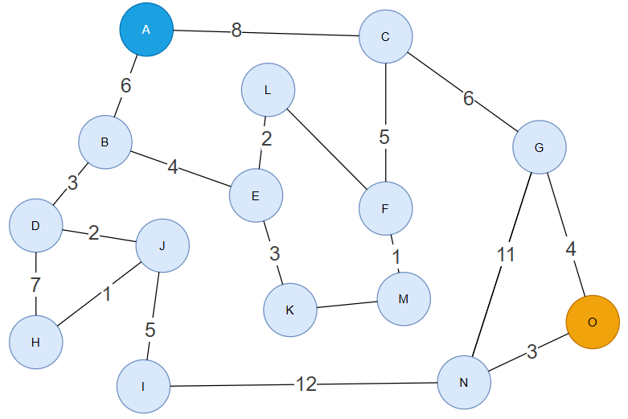
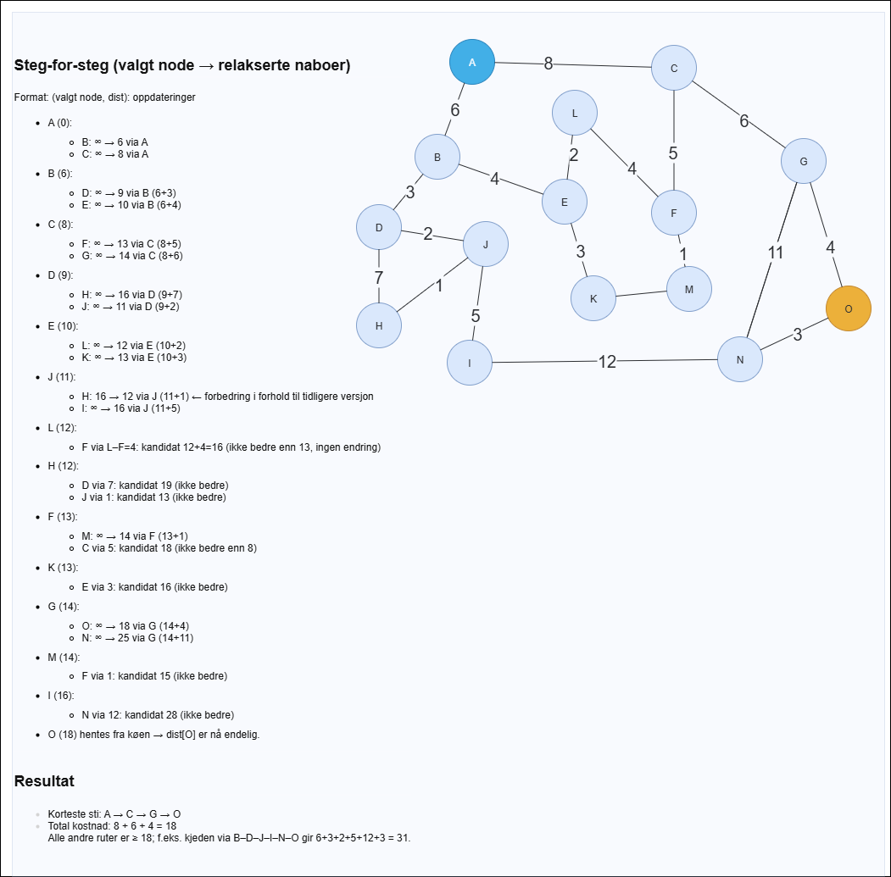

# Dijkstra's Algoritme

## Hva er Dijkstra's algoritme?

**Dijkstra's algoritme** er en algoritme som brukes for å finne den **korteste veien** fra en **startnode** til alle andre noder i en **vektet graf**.  
I motsetning til **Breadth-First Search (BFS)**, som fungerer kun på **uvektede grafer**, tar Dijkstra hensyn til **vektene på kantene**.

Algoritmen ble utviklet av **Edsger W. Dijkstra** i 1956 og er mye brukt i moderne teknologi, blant annet i:

- GPS og navigasjonssystemer
- Nettverksruting (f.eks. internett-trafikk)
- Spillutvikling og AI
- Planlegging og logistikk

---

## Begrepsforklaringer

- **Startnode:** Noden vi starter beregningen fra.
- **Vektet graf:** En graf der hver kant har en kostnad eller vekt.
- **Avstand (distance):** Den totale kostnaden for å komme fra startnoden til en bestemt node.
- **Prioritetskø (min-heap):** Datastruktur som alltid velger noden med **lavest nåværende avstand** først.
- **Besøkt (visited):** En liste eller et sett som markerer hvilke noder som er ferdig prosessert.

---

## Hvorfor Dijkstra?

BFS finner den korteste veien i **uvektede grafer**, men i virkelige problemer har kanter ofte forskjellige kostnader.  
Eksempler:

- Kjappeste vei i et veinett med ulik kjøretid mellom byer.
- Laveste kostnad i et datanettverk.
- Korteste rute i et spillkart.

Dijkstra løser dette ved å **gradvis bygge den korteste veien** til hver node.

---
<div style="page-break-after:always;"></div>

## Dijkstra fra **A** til **O** (vektet graf)

Bildet viser en vektet, urettet graf. Vi vil finne **korteste vei fra A til O** med
**Dijkstra's algoritme** og vise *alle oppdateringsstegene* (relaksjoner).

> Merk: Kantvekter som ikke er synlige på figuren (f.eks. L–F og K–M) påvirker
> ikke den korteste stien **A→O** i dette eksemplet, og blir derfor ikke brukt.

---

### Noder og kjente kanter (med vekter)



- **A**: A–B=6, A–C=8
- **B**: B–A=6, B–D=3, B–E=4
- **C**: C–A=8, C–F=5, C–G=6
- **D**: D–B=3, D–H=7, D–J=2
- **E**: E–B=4, E–L=2, E–K=3
- **F**: F–C=5, F–M=1, **F–L=4**
- **G**: G–C=6, G–N=11, G–O=4
- **H**: H–D=7, H–J=1
- **I**: I–J=5, I–N=12
- **J**: J–D=2, J–H=1, J–I=5
- **K**: K–E=3  (K–M ikke brukt)
- **L**: L–E=2, **L–F=4**
- **M**: M–F=1  (M–K ikke brukt)
- **N**: N–G=11, N–I=12, N–O=3
- **O**: O–G=4, O–N=3

---
<div style="page-break-after: always;"></div>

---

### Startverdier

- `dist[A]=0`, `dist[X]=∞` for alle andre X
- `forgjenger[A]=None`
- Min-prioritetskø inneholder (0, A)

---

### Steg-for-steg (valgt node → relakserte naboer)



---
<div style="page-break-after: always;"></div>

### Korteste vei og total kostnad

- **Sti:** `A → C → G → O`  
- **Kostnad:** `A–C (8) + C–G (6) + G–O (4) = 18`

Dette er den korteste veien fordi alle alternative ruter som når høyre side
må enten gå via **C** uansett, eller går via den lange kjeden gjennom **B–D–J–I–N**, som er betydelig dyrere:
`6 + 3 + 2 + 5 + 12 + 3 = 31` til O for den ruten.

---
<div style="page-break-after: always;"></div>

---

## Pseudokode (kort)

```text
for alle v: dist[v] = ∞; prev[v] = None
dist[A] = 0
PQ = {(0, A)}

while PQ ikke tom:
    (d, u) = pop_min(PQ)
    hvis d > dist[u]: fortsett
    for (u, v, w) i kanter:
        hvis dist[u] + w < dist[v]:
            dist[v] = dist[u] + w
            prev[v] = u
            push(PQ, (dist[v], v))
```

---

### Rekonstruksjon av sti (fra prev-tabellen)

1. Start i **O** → `prev[O] = G`  
2. `G` → `prev[G] = C`  
3. `C` → `prev[C] = A`  
4. `A` → `None` (start)

Snudd gir: **A → C → G → O**.

---

<div style="page-break-after:always;"></div>

## Viktige egenskaper

- **Tidskompleksitet:** O((V + E) log V)  
  - V = antall noder (vertices)
  - E = antall kanter (edges)
  - Bruker prioritetskø for effektivitet.

- **Plasskompleksitet:** O(V) for lagring av avstander og besøkte noder.

| Algoritme  | Vektet graf? | Finner korteste vei? |
|------------|--------------|----------------------|
| BFS        | Nei          | Ja (kun uvektet)    |
| DFS        | Nei          | Ikke garantert      |
| Dijkstra   | Ja           | Ja                  |

---

## Bruksområder

| Bruksområde       | Beskrivelse |
|-------------------|-------------|
| **GPS og navigasjon** | Finne raskeste rute mellom steder. |
| **Internett-ruting** | Velge vei med minst latency eller kostnad. |
| **Spill og AI** | Pathfinding for NPC-er og enheter. |
| **Transport og logistikk** | Optimalisere ruter og kostnader. |

---

## Oppsummering

- Dijkstra finner **korteste vei i vektede grafer**.
- Starter fra én node og bygger gradvis opp den korteste veien til alle andre.
- Bruker en **prioritetskø** for effektivitet.
- Har mange praktiske bruksområder, inkludert GPS, nettverk, spill og planlegging.
