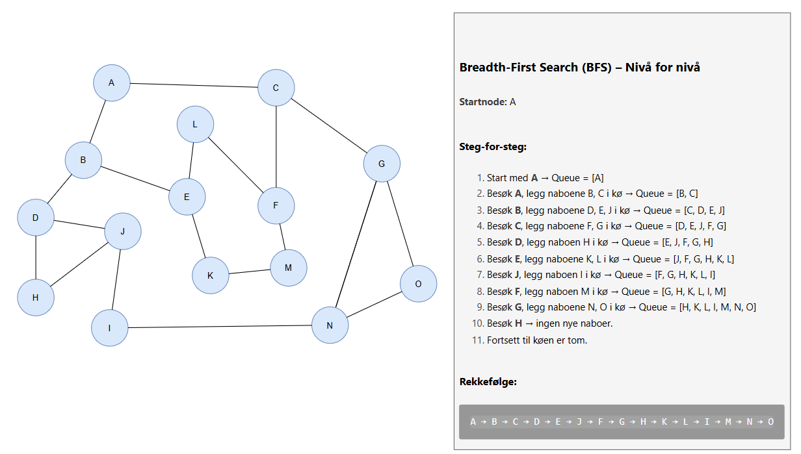

# Traversering av graf

Vi har denne grafen med noder:

## 1. Breadth-First Search (BFS) – Nivå for nivå

**BFS** besøker grafen **nivå for nivå** og bruker en **kø (queue)** for å holde oversikt over hvilke noder som skal besøkes neste.
Dette sikrer at vi finner den korteste veien i en **uvektet graf**.

**Startnode:** A

---

## 2. Depth-First Search (DFS) – Går dypt først

**DFS** går **så dypt som mulig** før den backtracker. Dette kan implementeres med **rekursjon** eller **stack**.

---

## Oppsummeringstabell

| Traversering | Rekkefølge |
|--------------|------------|
| **BFS** | A B C D E J F G H K L I M N O |
| **DFS** | A B D H J I E K M L C F G N O |

---

## Visual forklaring
- **BFS:** Perfekt for å finne den korteste veien i uvektede grafer. Brukes i navigasjon, nettverk og spill.
- **DFS:** Bra for å utforske hele grafen, oppdage sammenhengende komponenter, og løse puslespill eller labyrinter.
