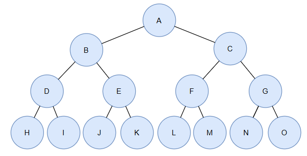
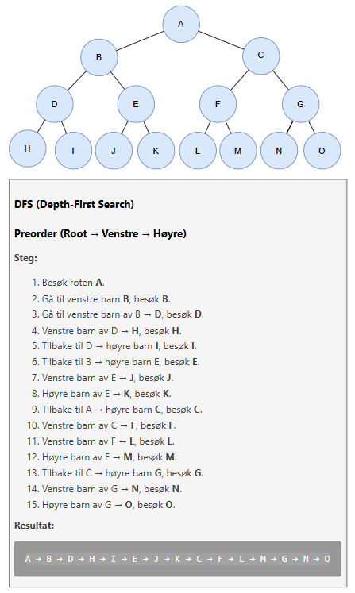
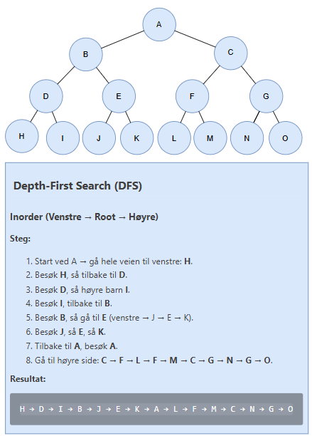
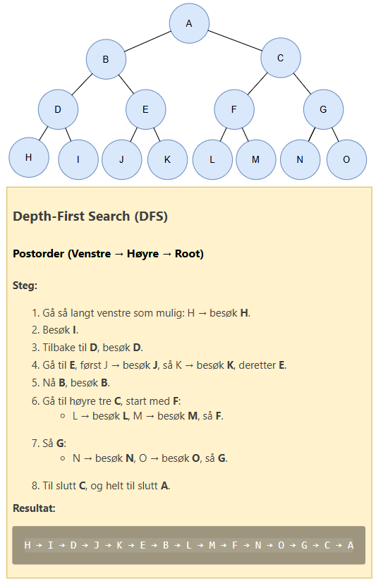
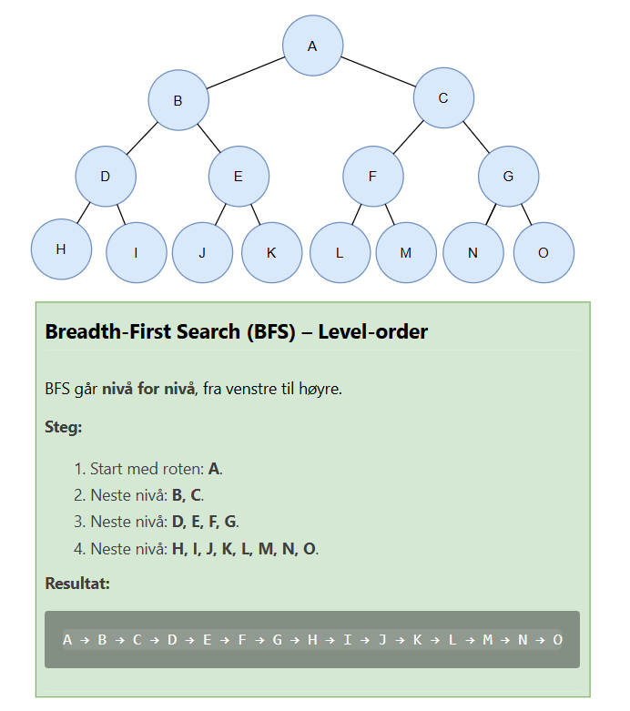

# Traversering av treet

Vi har dette treet:

Det finnes to hovedkategorier av traverseringer:

- **Depth-First Search (DFS)** – går dypt først, følger grener helt ned før den backtracker.
  - Preorder (Root → Venstre → Høyre)
  - Inorder (Venstre → Root → Høyre)
  - Postorder (Venstre → Høyre → Root)
- **Breadth-First Search (BFS)** – går bredt først, besøker treet nivå for nivå (Level-order).

---

## 1. Depth-First Search (DFS)

DFS går **så dypt som mulig** før den backtracker.

### **1.1 DFS: Preorder (Root → Venstre → Høyre)**

---

### **1.2 DFS: Inorder (Venstre → Root → Høyre)**

---

### **1.3 DFS: Postorder (Venstre → Høyre → Root)**

---

## 2. Breadth-First Search (BFS) – Level-order

### **2.1 BFS: Level-order (Venstre → Høyre)**

---

## Oppsummeringstabell

| Traversering          | Rekkefølge |
|-----------------------|------------|
| **Preorder**          | A B D H I E J K C F L M G N O |
| **Inorder**           | H D I B J E K A L F M C N G O |
| **Postorder**         | H I D J K E B L M F N O G C A |
| **Level-order (BFS)** | A B C D E F G H I J K L M N O |

---

## Visual Forklaring

- **Preorder:** Root **før** barna → brukes til å **kopiere trær**.
- **Inorder:** Venstre, root, høyre → brukes i **binære søketrær** for sortering.
- **Postorder:** Root **etter** barna → brukes til **sletting** av trær.
- **Level-order:** Perfekt til BFS → **korteste vei**, AI og spill.
