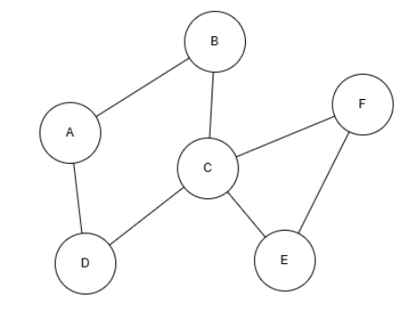
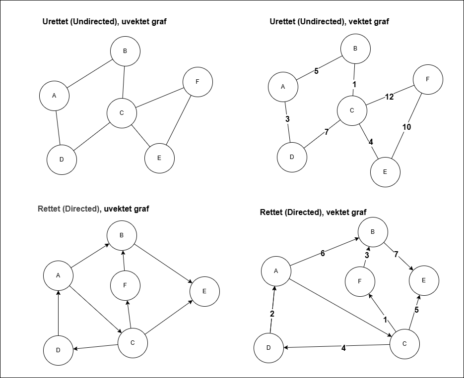
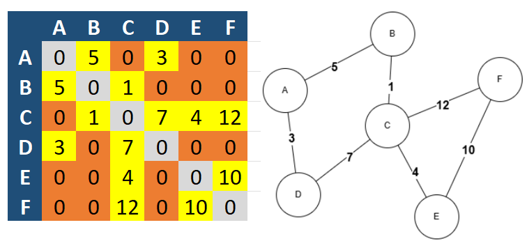

# Innføring i Grafstrukturer (Graphs)

## Hva er en graf?

En **graf** er en datastruktur som brukes til å modellere relasjoner mellom objekter.
En graf består av:

- **Noder (vertices)**: Representerer objektene (for eksempel byer, personer, nettsider).
- **Kanter (edges)**: Representerer forbindelser eller relasjoner mellom nodene.

Formelt kan en graf defineres som \( G = (V, E) \), hvor:

- \( V \) er mengden av noder (vertices).
- \( E \) er mengden av kanter (edges).

Eksempel: En graf som representerer byer og veier mellom dem.



- Noder: {A, B, C, D, E, F}
- Kanter: {(A, B), (A, D), (B, C), (C, D), (C, E), (C, F), (E,F)}

---
<div style="page-break-)))}

---
<div style="page-break-after:always;"></div>

## Typer grafer

### 1. Rettet vs. Urettet graf

- **Urettet graf (Undirected Graph):**
  - Kantene har ingen retning.
  - Eksempel: Vennskap i et sosialt nettverk.

- **Rettet graf (Directed Graph / Digraph):**
  - Kantene har en retning, vist med en pil.
  - Eksempel: Følgere på Twitter (A → B betyr at A følger B).

### 2. Vektet vs. Uvektet graf

- **Uvektet graf:** Alle kanter har lik "verdi".
- **Vektet graf:** Hver kant har en vekt, ofte brukt til å representere avstand, tid eller kostnad.

Eksempel: 



<div style="page-break-after:always;"></div>

### 3. Syklisk vs. Acyklisk graf

- **Syklisk graf:** Har minst én sti som starter og slutter i samme node (en syklus).
- **Acyklisk graf:** Har ingen sykluser.
  - **DAG (Directed Acyclic Graph):** En rettet graf uten sykluser. Brukes ofte i oppgaveplanlegging og avhengighetshåndtering.

### 4. Spesielle grafstrukturer

- **Tre (Tree):** En acyklisk, sammenhengende graf hvor alle noder er koblet, og det finnes kun én vei mellom to noder.
- **Fullstendig graf (Complete Graph):** Hver node er koblet til alle andre noder.
- **Bipartitt graf:** Noder kan deles inn i to grupper hvor kanter kun går mellom gruppene.

---
<div style="page-break-after:always;"></div>

## Representasjon av grafer

Det finnes flere måter å representere grafer i kode:

### 1. Adjacency Matrix (nabolagsmatrise)

En 2D-matrise hvor rad *i* og kolonne *j* indikerer om det finnes en kant mellom node *i* og node *j*.

- Fordel: Rask oppslagstid.
- Ulempe: Bruker mye minne for store grafer.

Eksempel for grafen:



### 2. Adjacency List (nabolagsliste)

Hver node har en liste over sine naboer.

- Fordel: Mer minneeffektiv for store grafer.

Eksempel:

```
A: [B, D]
B: [A, C]
C: [B, D, E, F]
D: [A, C]
E: [C, F]
F: [C, E]
```

---
<div style="page-break-after:always;"></div>

## Problemer løst med grafer

Grafer er ekstremt fleksible og brukes til å løse en rekke problemer som andre datastrukturer ikke håndterer like godt.

| Problem | Eksempel | Algoritme |
|----------|----------|-----------|
| Korteste vei | Finn raskeste vei mellom to byer | Dijkstra, Bellman-Ford |
| Minimum Spanning Tree | Bygge billigste nettverk av kabler | Kruskal, Prim |
| Søk etter sti | Kan du nå fra A til B? | BFS, DFS |
| Syklusdeteksjon | Oppdage deadlock i operativsystem | DFS |
| Toppologisk sortering | Planlegging av oppgaver med avhengigheter | DFS |
| Nettverksflyt | Maksimal dataflyt i et nettverk | Ford-Fulkerson |

---

## Hvorfor bruke grafer?

Grafer løser problemer som handler om **relasjoner** mellom objekter.
Andre datastrukturer som lister og trær kan ikke like enkelt representere komplekse nettverk med mange krysskoblinger.

Eksempler på bruksområder:

- Sosiale nettverk (Facebook, LinkedIn)
- GPS og navigasjonssystemer
- Planlegging og prosessavhengigheter (byggeprosjekter, kompilering)
- Anbefalingssystemer (Netflix, Spotify)
- Datakommunikasjon og nettverkstopologier
- Maskinlæring (Graph Neural Networks)

---

## Algoritmer relatert til grafer

De mest brukte algoritmene innen grafteori:

- **DFS (Depth-First Search):** Utforsker grafen i dybden.
- **BFS (Breadth-First Search):** Utforsker grafen i bredden.
- **Dijkstra's algoritme:** Finner korteste vei i en vektet graf.
- **Kruskal's algoritme:** Finner minimum spanning tree.
- **Prim's algoritme:** Alternativ for minimum spanning tree.
- **Topologisk sortering:** Brukes for oppgaveplanlegging i DAG-er.

---

## Oppsummering

- En **graf** er en datastruktur som består av **noder** og **kanter**.
- Den kan være rettet eller urettet, vektet eller uvektet, syklisk eller acyklisk.
- Grafer representerer komplekse relasjoner og nettverk på en måte som andre strukturer ikke kan.
- Mange viktige algoritmer bygger på grafer, som Dijkstra, BFS, DFS, Kruskal og Prim.
